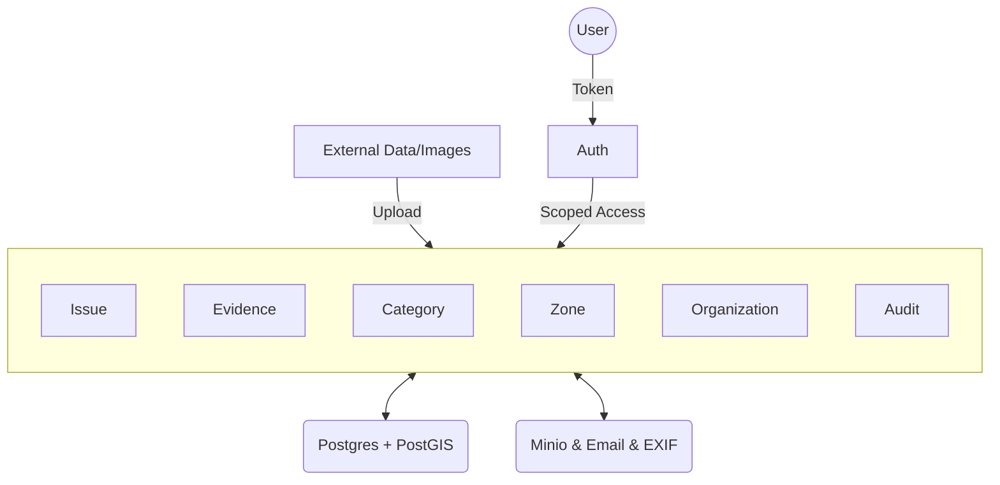
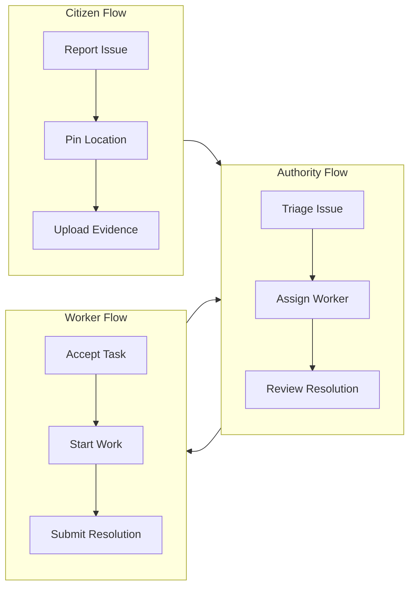

# Design

This document outlines the architecture of the Urban Infrastructure Issue Reporting System, along with the tech stack used for the implementation, the database schema, and all API endpoints.

## Architecture

The system is divided into three layers: auth, data, and modules.

Each user interaction with a module is first authorized by the auth subsystem. Each user is given scoped access to the modules based on their level of authorization. Each module can also interact with any other module as needed.

Each module contributes to the functionality of the system. For example, the `issue` module defines the lifecycle of an infrastructure report, and the `evidence` module enables the storage and validation of visual proof.

Each service provides an integration with an external system via their API or specialized library. These services handle object storage, metadata extraction, and communication.

### Authentication

Authentication is performed by a user exchanging their e-mail address for a one-time password (OTP). Upon successful verification of the OTP, the user receive a cryptographically signed JWT token that expires seven days from the time of issue. Each signed token contains the ID of the user, their role, and their associated organization ID. The token must be used by the user to authenticate themselves in every subsequent interaction with the system.

### Authorization

Users are assigned roles: `sysadmin`, `admin`, `worker`, `citizen`. Each role has one or more scopes associated with it by default that give some capabilities to users assigned that role.

| Scope                  | Description                                         |
| ---------------------- | --------------------------------------------------- |
| `system/manage`        | Manage organizations, zones, and global config.     |
| `system/audit`         | View global audit trails across all organizations.  |
| `issues/create`        | Create a new infrastructure report.                 |
| `issues/fetch`         | List out all issues.                                |
| `issues/triage`        | Modify issue priority and category.                 |
| `issues/assign`        | Assign or unassign workers to an issue.             |
| `tasks/manage`         | Accept, start, and resolve assigned tasks.          |
| `evidence/verify`      | Review before/after resolution evidence.            |
| `workers/manage`       | Invite and deactivate field force personnel.        |

Each scope will be suffixed by `/all` or `/own`. The former indicates that the user can access all resources within their organization (or the system for sysadmins), while the latter indicates the user can only access resources they have created or been assigned to.

The `sysadmin` role will have all `system/*` and `issues/fetch/all` scopes. The `admin` role will have `issues/*`, `workers/*`, and `evidence/*` scopes for their specific organization. The `worker` role will have `tasks/manage` and `issues/fetch/own`. The `citizen` role will have `issues/create` and `issues/fetch/own`.

### Data

The data stored in the database includes spatial geometries (points and polygons), issue lifecycles, user profiles, and binary evidence paths. Geolocation data is ingested from browser APIs, and visual evidence is ingested from camera uploads.

### Modules

Each module makes up an important part of the overall system.

#### Auth

> This module enables all actions related to user identification, OTP generation, and session management.

#### Issue

> This module defines the state machine for infrastructure reports (Reported -> Assigned -> Accepted -> In Progress -> Resolved -> Closed).

#### Evidence

> This module manages the lifecycle of visual proof, including EXIF metadata validation and storage path mapping.

#### Organization

> This module manages municipal authorities and their associated zones.

#### Zone

> This module defines the geometric boundaries of administrative jurisdictions.

#### Audit

> This module records every mutation in the system for accountability and transparency.

### Services

Each service provides an integration with an external system.

#### Storage (Minio)

> This service provides S3-compatible object storage for all high-resolution evidence photos.

#### Metadata (EXIF)

> This service extracts GPS and timestamps from binary image data to verify the integrity of reports.

#### Communication (Email)

> This service handles the delivery of OTP codes to users.

## Features

The following diagram shows the primary resolution workflow.

### Issue Reporting

1. Create a Report.

- Citizen specifies a location on the map.
- System performs a silent 5m duplicate check using PostGIS.
- Uploads a photo; system extracts EXIF to verify coordinates.

2. View My Reports.

- Citizens can track the real-time status of their own submissions.

### Administrative Triage

3. Kanban Dashboard.

- Admin views issues in status columns.
- Issues are automatically flagged if they breach their category's SLA.

4. Bulk Assignment.

- Admin selects multiple reports and assigns them to a specific field worker.

5. Worker Management.

- Invite new workers to the organization.
- Deactivate workers, which automatically unassigns their active tasks back to the pool.

### Field Force Execution

6. Task Acceptance.

- Worker views assigned tasks and provides an ETA.

7. Resolution Submission.

- Worker captures an "After" photo on-site.
- System enforces camera-only capture to prevent fraud.

### Analytics & Audit

8. Heatmaps.

- Real-time visualization of city-wide issue density using `leaflet.heat`.
- Data served via PostGIS spatial aggregation from the `/analytics/heatmap` endpoint.

9. Audit Trails.

- Immutable log of every status change and administrative action.
- System Admin interface provides a high-fidelity table with detailed Before/After state comparisons.

10. Address Search (Geocoding).

- Integrated `Leaflet Control Geocoder` in the reporting wizard.
- Allows citizens to find locations via text search (e.g., landmarks or street names) in addition to map selection.

## Technology

The auth subsystem uses [JWT][1] tokens for authenticating users. These are secure, stateless tokens that carry user identity and roles.

The data subsystem uses [PostgreSQL][2] with the [PostGIS][3] extension. This allows for industrial-grade spatial queries such as 5-meter proximity checks and zone intersection.

The server-side code is written in [Python][4], using [FastAPI][5] as the server framework. FastAPI provides high performance, automatic OpenAPI documentation, and asynchronous I/O support. [SQLModel][6] is used for ORM, combining the power of SQLAlchemy with the simplicity of Pydantic.

The client-side code uses the [React][7] framework with [Vite][8] as the build tool. The UI is built using [Tailwind CSS][9] and [Shadcn UI][10] for a clean, modern aesthetic. [Framer Motion][11] handles all animations and micro-interactions. Maps are enhanced with [Leaflet Geocoder][12] for address search and [Leaflet Heat][13] for analytics.

[1]: https://jwt.io
[2]: https://postgresql.org
[3]: https://postgis.net
[4]: https://python.org
[5]: https://fastapi.tiangolo.com
[6]: https://sqlmodel.tiangolo.com
[7]: https://react.dev
[8]: https://vitejs.dev
[9]: https://tailwindcss.com
[10]: https://ui.shadcn.com
[11]: https://framer.com/motion
[12]: https://github.com/perliedman/leaflet-control-geocoder
[13]: https://github.com/Leaflet/Leaflet.heat

## Database

The data is stored in a PostgreSQL database with the PostGIS extension enabled.

### Tables

#### `user`

| column          | type        | remarks                                         |
| :-------------- | :---------- | :---------------------------------------------- |
| `id`            | `uuid`      | primary key                                     |
| `email`         | `text`      | unique, indexed                                 |
| `full_name`     | `text`      | user's name                                     |
| `role`          | `text`      | enum: `citizen`, `admin`, `worker`, `sysadmin`  |
| `org_id`        | `uuid`      | foreign key to `organization.id`                |
| `status`        | `text`      | default `ACTIVE`                                |
| `last_login_at` | `timestamp` | updated on every sign-in                        |

#### `organization`

| column    | type   | remarks                    |
| :-------- | :----- | :------------------------- |
| `id`      | `uuid` | primary key                |
| `name`    | `text` | authority name (e.g., GHMC) |
| `zone_id` | `uuid` | foreign key to `zone.id`   |

#### `zone`

| column     | type       | remarks                      |
| :--------- | :--------- | :--------------------------- |
| `id`       | `uuid`     | primary key                  |
| `name`     | `text`     | zone name                    |
| `boundary` | `geometry` | PostGIS Polygon (SRID 4326) |

#### `category`

| column              | type      | remarks                      |
| :------------------ | :-------- | :--------------------------- |
| `id`                | `uuid`    | primary key                  |
| `name`              | `text`    | e.g., "Pothole", "Drainage"  |
| `default_priority`  | `text`    | enum: `P1`, `P2`, `P3`, `P4` |
| `expected_sla_days` | `integer` | SLA duration in days         |

#### `issue`

| column             | type        | remarks                                     |
| :----------------- | :---------- | :------------------------------------------ |
| `id`               | `uuid`      | primary key                                 |
| `category_id`      | `uuid`      | foreign key to `category.id`                |
| `status`           | `text`      | current state in machine                    |
| `location`         | `geometry`  | PostGIS Point (SRID 4326)                  |
| `reporter_id`      | `uuid`      | foreign key to `user.id`                    |
| `worker_id`        | `uuid`      | foreign key to `user.id`                    |
| `org_id`           | `uuid`      | foreign key to `organization.id`            |
| `priority`         | `text`      | current priority level                      |
| `report_count`     | `integer`   | number of aggregated duplicate reports       |
| `rejection_reason` | `text`      | reason provided by admin on rejection       |
| `eta_duration`     | `text`      | estimated time provided by worker           |
| `created_at`       | `timestamp` | default `now()`                             |
| `updated_at`       | `timestamp` | last mutation time                          |

#### `evidence`

| column           | type        | remarks                                 |
| :--------------- | :---------- | :-------------------------------------- |
| `id`             | `uuid`      | primary key                             |
| `issue_id`       | `uuid`      | foreign key to `issue.id`               |
| `type`           | `text`      | enum: `REPORT`, `RESOLVE`               |
| `file_path`      | `text`      | relative path in Minio bucket           |
| `exif_timestamp` | `timestamp` | timestamp extracted from image metadata |
| `exif_lat`       | `float`     | latitude extracted from image metadata  |
| `exif_lng`       | `float`     | longitude extracted from image metadata |

#### `otp`

| column       | type        | remarks                       |
| :----------- | :---------- | :---------------------------- |
| `id`         | `integer`   | primary key                   |
| `email`      | `text`      | target email                  |
| `code`       | `text`      | 6-digit verification code     |
| `expires_at` | `timestamp` | expiry time (usually +10m)    |
| `created_at` | `timestamp` | default `now()`               |

#### `auditlog`

| column        | type        | remarks                                     |
| :------------ | :---------- | :------------------------------------------ |
| `id`          | `uuid`      | primary key                                 |
| `action`      | `text`      | e.g., `STATUS_CHANGE`, `ASSIGNMENT`         |
| `entity_type` | `text`      | e.g., `ISSUE`, `USER`                       |
| `entity_id`   | `uuid`      | ID of the modified entity                   |
| `actor_id`    | `uuid`      | ID of the user who performed the action     |
| `old_value`   | `text`      | previous state                              |
| `new_value`   | `text`      | new state                                   |
| `created_at`  | `timestamp` | default `now()`                             |

## API Endpoints

### Authentication

| method | endpoint             | description                    | scope           |
| :----- | :------------------- | :----------------------------- | :-------------- |
| `post` | `/auth/otp-request`  | generate and send OTP          | `none`          |
| `post` | `/auth/login`        | verify OTP and return JWT token | `none`          |
| `post` | `/auth/google-mock`  | simulated google oauth login   | `none`          |

### Issue Management (Citizen)

| method | endpoint             | description                    | scope           |
| :----- | :------------------- | :----------------------------- | :-------------- |
| `post` | `/issues/report`     | submit new infrastructure issue | `issues/create` |
| `get`  | `/issues/my-reports` | list issues reported by user   | `issues/fetch`  |

### Administrative (Authority)

| method | endpoint                    | description                    | scope              |
| :----- | :-------------------------- | :----------------------------- | :----------------- |
| `get`  | `/admin/issues`             | list all issues in organization | `issues/fetch/all` |
| `get`  | `/admin/workers`            | list all field workers          | `workers/manage`   |
| `post` | `/admin/bulk-assign`        | assign multiple issues to worker| `issues/assign`    |
| `post` | `/admin/deactivate-worker`  | deactivate worker and reset tasks| `workers/manage`   |
| `post` | `/admin/assign`             | assign single issue             | `issues/assign`    |
| `post` | `/admin/update-priority`    | manual priority override        | `issues/triage`    |
| `get`  | `/admin/categories`         | list active issue categories   | `issues/create`    |

### Field Force (Worker)

| method | endpoint                    | description                    | scope              |
| :----- | :-------------------------- | :----------------------------- | :----------------- |
| `get`  | `/worker/tasks`             | list tasks assigned to worker  | `issues/fetch/own` |
| `post` | `/worker/tasks/:id/accept`  | acknowledge task with ETA      | `tasks/manage`     |
| `post` | `/worker/tasks/:id/start`   | signal start of on-site work   | `tasks/manage`     |
| `post` | `/worker/tasks/:id/resolve` | submit resolution with proof   | `tasks/manage`     |

### Media & Evidence

| method | endpoint                    | description                    | scope           |
| :----- | :-------------------------- | :----------------------------- | :-------------- |
| `get`  | `/media/:issue_id/before`   | retrieve original issue photo  | `evidence/verify` |
| `get`  | `/media/:issue_id/after`    | retrieve resolution photo      | `evidence/verify` |
